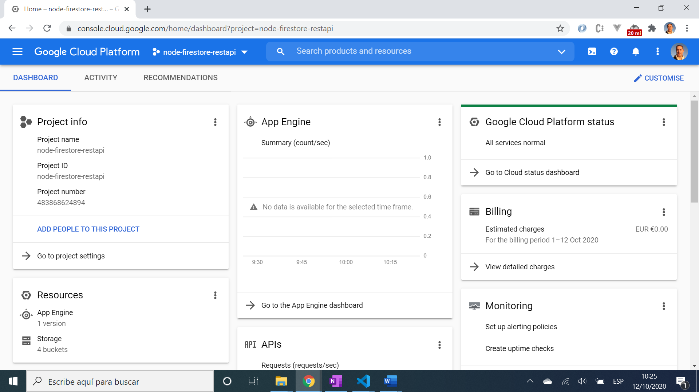

# :zap: Node Firestore Rest API

* Uses Node.js to connect with Google Cloud data storage and CRUD data. This is code from Google and is stored here to learn how Google write a CRUD app.
* **Note:** to open web links in a new window use: _ctrl+click on link_


## :page_facing_up: Table of contents

* [:zap: Node Firestore Rest API](#zap-node-firestore-rest-api)
  * [:page_facing_up: Table of contents](#page_facing_up-table-of-contents)
  * [:books: General info](#books-general-info)
  * [:camera: Screenshots](#camera-screenshots)
  * [:signal_strength: Technologies](#signal_strength-technologies)
  * [:floppy_disk: Setup](#floppy_disk-setup)
  * [:computer: Code Examples](#computer-code-examples)
  * [:cool: Features](#cool-features)
  * [:clipboard: Status & To-Do List](#clipboard-status--to-do-list)
  * [:clap: Inspiration](#clap-inspiration)
  * [:envelope: Contact](#envelope-contact)

## :books: General info

* This app was created using Google Cloud App Engine and a Secure Shell (SSH) terminal with access to Cloud Storage to store book data and a storage bucket for images. The code was copied into this Github repo but requires Google authentication to be able to run it from Visual Studio.

## :camera: Screenshots

.

## :signal_strength: Technologies

* [Express v4](https://expressjs.com/) Fast, unopinionated, minimalist web framework for Node.js
* [Multer v1](https://www.npmjs.com/package/multer) to handle multipart/form-data for uploading files.
* [Cloud Firestore: Node.js Client](https://www.npmjs.com/package/@google-cloud/firestore) Node.js Server SDK for Google Cloud Firestore, a NoSQL document database.
* [google-cloud/storage](https://www.npmjs.com/package/@google-cloud/storage) client for Google Cloud.
* [pug v3](https://www.npmjs.com/package/pug) template engine for Node.js

## :floppy_disk: Setup

* Add Google Cloud credentials then run `npm run start` or `node server.js` for a dev server (this has not been tested).
* Navigate to `http://localhost:5000/` or port 8080 for home screen.
* The app will not automatically reload if you change any of the source files.

## :computer: Code Examples

* extract from `books/api.js` to retrieve a page of books (up to ten at a time).

```javascript
router.get('/', async (req, res) => {
  const {books, nextPageToken} = await db.list(10, req.query.pageToken);
  res.json({
    items: books,
    nextPageToken,
  });
});
```

## :cool: Features

* This was all run in Google Cloud using an SSH terminal, following Google tutorial instructions and it worked first time
* Pug makes it easier both to write reusable HTML and to render data from the books API

## :clipboard: Status & To-Do List

* Status: Working in the cloud
* To-Do: nothing, this is just to study and comment Google-supplied code to learn best practises

## :clap: Inspiration

* [Google CLoud Getting started with Node.js](https://cloud.google.com/nodejs/getting-started)
* [A Beginner’s Guide to Pug](https://www.sitepoint.com/a-beginners-guide-to-pug/#:~:text=Pug%20is%20a%20template%20engine,from%20a%20database%20or%20API.)

## :file_folder: License

* N/A.

## :envelope: Contact

* Repo created by [ABateman](https://github.com/AndrewJBateman), email: gomezbateman@yahoo.com
